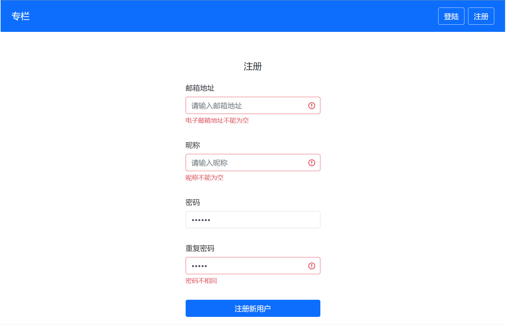
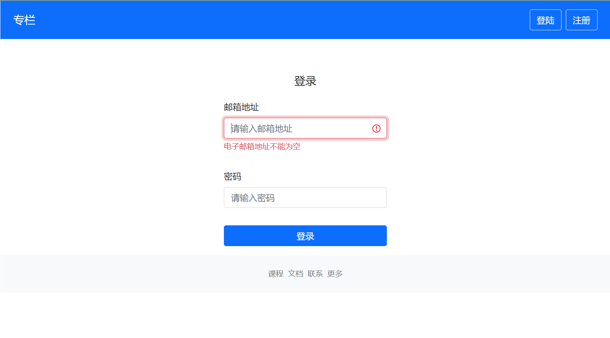
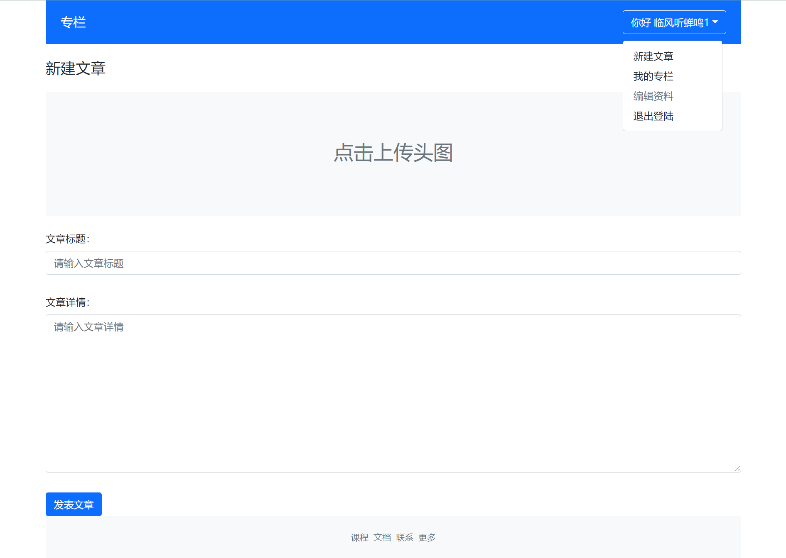
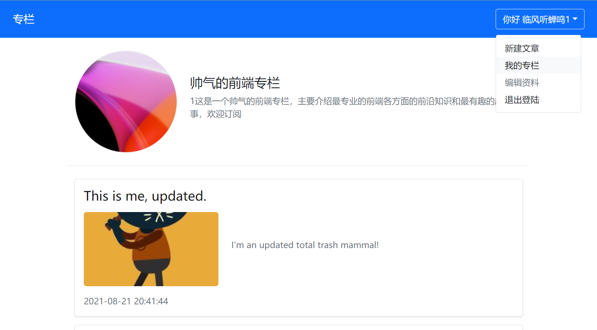
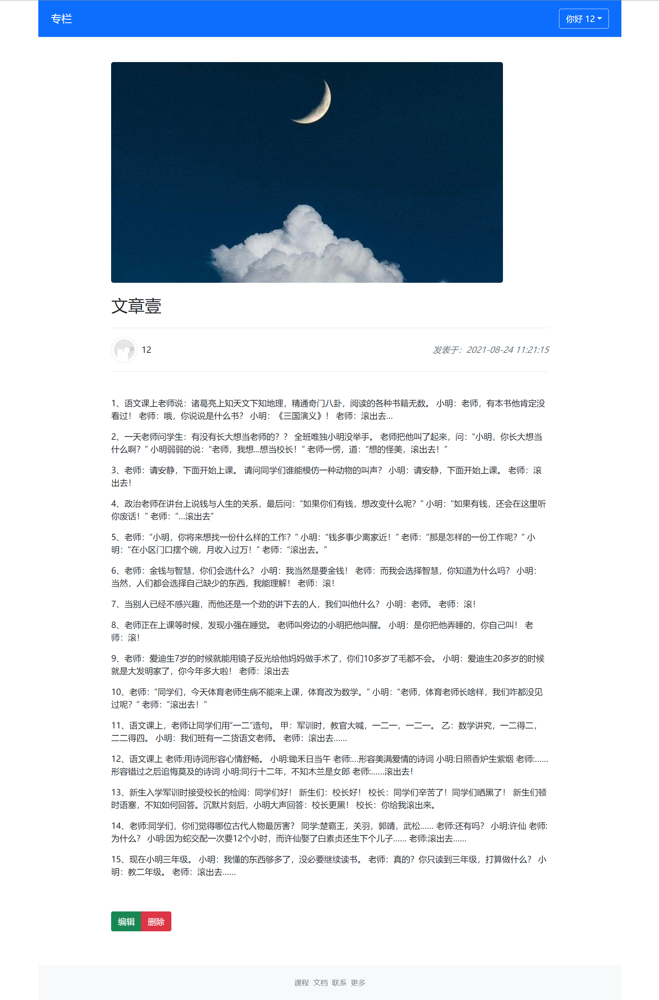

# column_blogs简介
这个项目是我跟着慕课网做的一个基于vue3和TypeScript实现的博客专栏网站

采用的技术栈：Vue3、vuex、vue-router和TypeScript。样式采用bootstrap5实现。网络请求基于Axios库。

后端接口由慕课网提供。


### 项目运行

1.安装依赖

```
npm install
```

2.运行

```
npm run serve
```


项目运行图

| 注册页面并校验                                     | 注册成功跳到登录页面                                   |
| -------------------------------------------------- | ------------------------------------------------------ |
|         |  |
| 首页及选项切换栏，点击用户可查看相关文章           | 发表文章页面                                           |
|  |         |
| 个人专栏页面                                       | 文章详情页                                             |
|     |           |

**项目演示站点：[http://zhihu.vikingship.xyz/](http://zhihu.vikingship.xyz/)**
